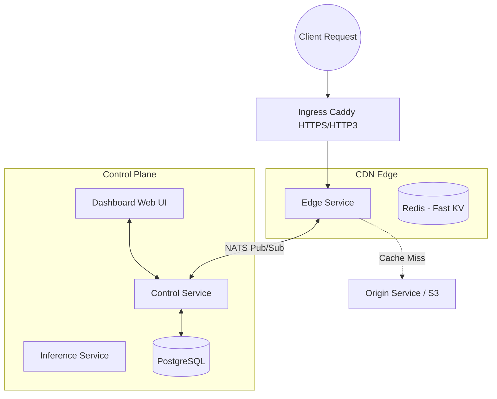

<div align="center">
  <h1>🚀 AstraCDN</h1>
  <p><b>A High-Performance, Self-Hosted Edge CDN & Web Application Firewall (WAF)</b></p>
  <p>Serve images, videos, and large files globally with advanced caching, built-in security, and on-the-fly media transformations.</p>
</div>

<br/>

AstraCDN is a modern, Go-based Content Delivery Network designed to be hosted on your own infrastructure—from a single local server to a globally distributed multi-edge Kubernetes cluster. It provides a full control plane, a beautiful dashboard, and a highly optimized edge caching layer.

---

## 📑 Table of Contents

- [✨ Core Features](#-core-features)
- [🏗️ System Architecture](#️-system-architecture)
- [🚀 Quick Start (Local Development)](#-quick-start-local-development)
- [💻 Using the Dashboard & API](#-using-the-dashboard--api)
- [🗄️ Storage Backends (Local vs S3)](#️-storage-backends-local-vs-s3)
- [🌐 Cloud & Production Deployment](#-cloud--production-deployment)
- [🛠️ Configuration & Service Ports](#️-configuration--service-ports)
- [📚 Documentation Directory](#-documentation-directory)

---

## ✨ Core Features

AstraCDN isn't just a basic proxy. It's built with advanced edge delivery capabilities out of the box:

### ⚡ Edge Caching & Delivery
- **Intelligent Caching**: Request coalescing (collapsing concurrent requests), segmented caching for streaming large objects (videos/binaries), and stale-while-revalidate support.
- **Media Optimization**: On-the-fly image transformations (resizing, format conversion, JPEG quality adjustment).
- **Compression**: Native support for Brotli and Gzip to minimize payload sizes.
- **Cache Management**: Instant cache purging, surrogate key invalidation, and proactive edge cache prewarming.

### 🛡️ Security & WAF
- **Web Application Firewall**: Block specific HTTP methods, path prefixes, headers, and IP ranges.
- **Access Control**: Secure content with Edge Signed URLs and Signed Cookies.
- **Rate Limiting**: Route-scoped rate limiting (RPS and Burst) to prevent abuse.
- **CORS Management**: Fully configurable Cross-Origin Resource Sharing.

### 🏢 Multi-Tenancy & Control
- **Tenant Management**: Built-in Role-Based Access Control (RBAC).
- **Billing Integration**: Webhook events for integrating with billing providers (e.g., Stripe).
- **Audit Logging**: Comprehensive audit trails for control plane operations.

---

## 🏗️ System Architecture

AstraCDN is built on a microservices architecture using **Go**, optimized for concurrency and high throughput.



### Services Overview
- **Edge**: The high-performance caching proxy. Handles WAF, compression, signing, and asset delivery.
- **Control**: The central API that manages routes, domains, rules, and tenants.
- **Dashboard**: A React-based web interface to manage your CDN infrastructure visually.
- **Inference**: An AI-integrated service (via OpenAI API) for advanced logic and semantic intelligence.
- **Ingress**: Uses Caddy to terminate HTTPS and HTTP/3 traffic for the edge.
- **Origin**: An example origin service that can serve files locally or proxy to an S3 bucket.

---

## 🚀 Quick Start (Local Development)

Run AstraCDN entirely on your local machine using Podman.

### Prerequisites
- [Podman](https://podman.io/) and `podman-compose`
- [Go](https://go.dev/) (optional, if compiling from source)
- `make`

### 1. Spin up the Local Stack
```sh
make up
```
*(This starts PostgreSQL, Redis, NATS, and all AstraCDN Go services).*

### 2. Access the Dashboard
Navigate to: **[http://localhost:3000](http://localhost:3000)**

> **Authentication**: The dashboard is protected by an access token. By default, the local dev token is `astracdn-local-dev-key`.

### 3. Verify Health
```sh
curl http://localhost:8080/health  # Check Edge health
```

### 4. Stop and Clean Up
```sh
make down          # Stop containers
make reset-data    # Wipe local databases and caches
make clean-images  # Remove built local images
```

---

## 💻 Using the Dashboard & API

The AstraCDN Dashboard provides a seamless way to manage your infrastructure:

- **Domain Management**: Add custom CDN hostnames. You can copy the generated DNS TXT records for ownership verification.
- **Route Rules**: Attach advanced behaviors to routes. Configure response header injection, set up WAF blocking paths, and define rate limits without writing code.
- **Route Versioning**: Inspect the history of delivery and security rule changes for safe rollouts.
- **Local Asset Testing**: Upload files directly through the dashboard to test the CDN. The dashboard returns a `/edge/assets/...` path which you can instantly view. 
  - *Note: Re-uploading an asset automatically publishes an edge cache purge.*

### Manually Serving Local Assets
You can also drop files directly into the local origin folder:
```sh
mkdir -p data/origin/assets
cp /path/to/video.mp4 data/origin/assets/video.mp4

# Fetch through the Edge
curl -H 'Host: cdn.localhost' http://localhost:8080/edge/assets/video.mp4
```

---

## 🗄️ Storage Backends (Local vs S3)

AstraCDN's origin and dashboard natively support **S3-compatible object storage** (AWS S3, MinIO, Cloudflare R2, etc.) for production media delivery.

### Using Local Storage
By default, the stack uses local disk storage (`data/origin`). 

### Using an S3 Backend
To switch to S3, set the following environment variables in your deployment:
```env
ORIGIN_STORAGE_MODE=s3
DASHBOARD_STORAGE_MODE=s3

# S3 Configuration
ORIGIN_S3_ENDPOINT=https://s3.your-region.amazonaws.com
ORIGIN_S3_BUCKET=your-bucket-name
ORIGIN_S3_ACCESS_KEY_ID=your_key
ORIGIN_S3_SECRET_ACCESS_KEY=your_secret
```
*When using S3, range requests, metadata headers, surrogate keys, and dashboard purge/upload actions all work seamlessly through the edge.*

To test with a local MinIO container, run:
```sh
make up-minio
```

---

## 🌐 Cloud & Production Deployment

AstraCDN is designed to scale. It provides native configurations for container orchestration and infrastructure-as-code.

- **Kubernetes**: See the `deploy/k8s/` directory for Kustomize overlays, Cert-Manager configs, and horizontal scaling setups.
- **OpenTofu / Terraform**: See `deploy/opentofu/` for provisioning the underlying cloud infrastructure (regional edges, databases).

### Deployment Workflows
- **`make global-edge-plan`**: Run an OpenTofu plan for production infrastructure.
- **`make cloud-deploy`**: Trigger the cloud deployment script.
- **`make cloud-verify`**: Run smoke tests against the deployed cloud environment.

---

## 🛠️ Configuration & Service Ports

Below is the network topology of the local development stack:

| Service | Port | Protocol / Notes |
|---------|------|----------------|
| **Dashboard** | `3000` | HTTP Web UI |
| **Edge** | `8080` | HTTP Caching Proxy |
| **Edge Ingress** | `8443` | HTTPS / HTTP3 (TCP & UDP via Caddy) |
| **Control API** | `8081` | HTTP API |
| **Inference API**| `8082` | HTTP API |
| **Origin** | `9000` | HTTP Static File Server |
| **PostgreSQL** | `5432` | Relational DB |
| **Redis** | `6379` | Key-Value / Cache |
| **NATS** | `4222` | Message Broker |
| **MinIO** | `9002` | Optional S3 Backend (if `make up-minio`) |

---

## 📚 Documentation Directory

Dive deeper into AstraCDN's capabilities by reviewing the official documentation:

**Usage & APIs**
- 📜 [OpenAPI Contract](api/openapi.yaml)
- 💻 [cURL Examples](docs/curl-examples.md)

**Architecture & Concepts**
- 🏢 [Tenant RBAC & Billing](docs/tenant-rbac-billing.md)
- 🌍 [Global Edge Network](docs/global-edge-network.md)
- 💿 [Local MinIO & Multi-Edge](docs/local-minio-multi-edge.md)
- 🔮 [Advanced CDN Backlog](docs/advanced-cdn-backlog.md)

**Production & SRE**
- 🚀 [Production Deployment](docs/production-deployment.md)
- ☁️ [Live Cloud Deployment](docs/live-cloud-deployment.md)
- 📖 [Production Runbook](docs/production-runbook.md)
- 🔐 [Production TLS](docs/production-tls.md)
- 📊 [SLO & Metrics](docs/slo.md)
- 💾 [Backup & Restore](docs/backup-restore.md)

**Development & CI/CD**
- 🏗️ [Kubernetes Skeleton](deploy/k8s/README.md)
- 🏗️ [OpenTofu Infrastructure](deploy/opentofu/README.md)
- 📦 [Database Migrations](docs/database-migrations.md)
- 🐳 [Image Build & Publish](docs/image-build-publish.md)
- 🔒 [Local HTTPS Guide](docs/local-https.md)

---
<div align="center">
  <i>Built with ❤️ for speed, security, and global delivery.</i>
</div>
